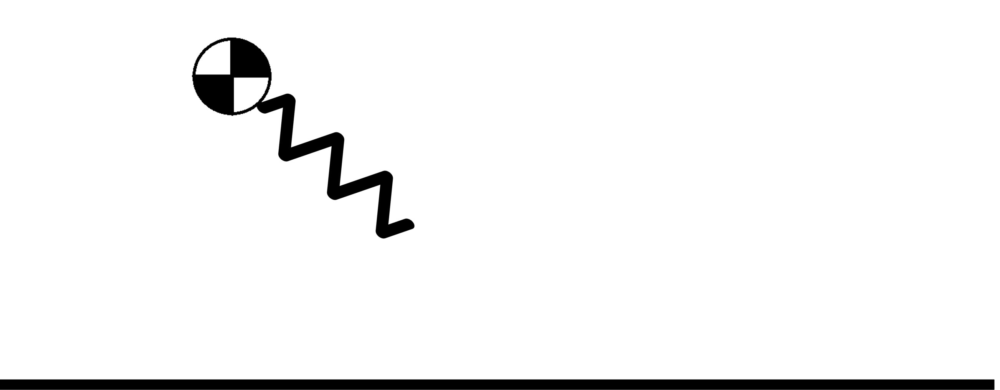
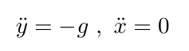
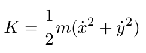
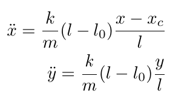
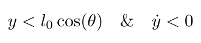

In this repo, I am simulating a mass-spring system to be later used for modeling robotic legs using SLIP model.

The function simulates a mass attached to a mass-less spring. There are two phases:
- Swing phase: In this phase, the mass is just free falling. The equations governing this phase are
  
    
  
    The spring has its nominal length `l0`.
- Stance phase: In this phase, the spring is touching the ground. When the spring is compressed, it exerts a force on the mass which will eventaully cuase a lift-off.     
During the stance phase, the dynamics of the system are calculated using the Lagrangian method.
The kinetic energy of the system is

and the potential energy of the system, which consists of gravitational potential energy and spring potential energy is

Enforcing the mass to be above the ground at all times, we get the following Lagrangian

This leads to the unconstraind stance phase dynamics

meaning this is the dynamics during the stance phase if the mass itself isn't touching the ground. If the mass is touching the ground, an upward force of `mg` is exerted on it and `y = y' = y'' = 0`.

Switching between stance and swing phase happens at touchdown and at lift-off.
Touchdown happens when 

    

where `xc` is the contact poin and `theta` is the foot placement angle.
Lift-off happens when 

This is the enitre logic implemented in the code.

TO BE FURTHER COMPLETED.
