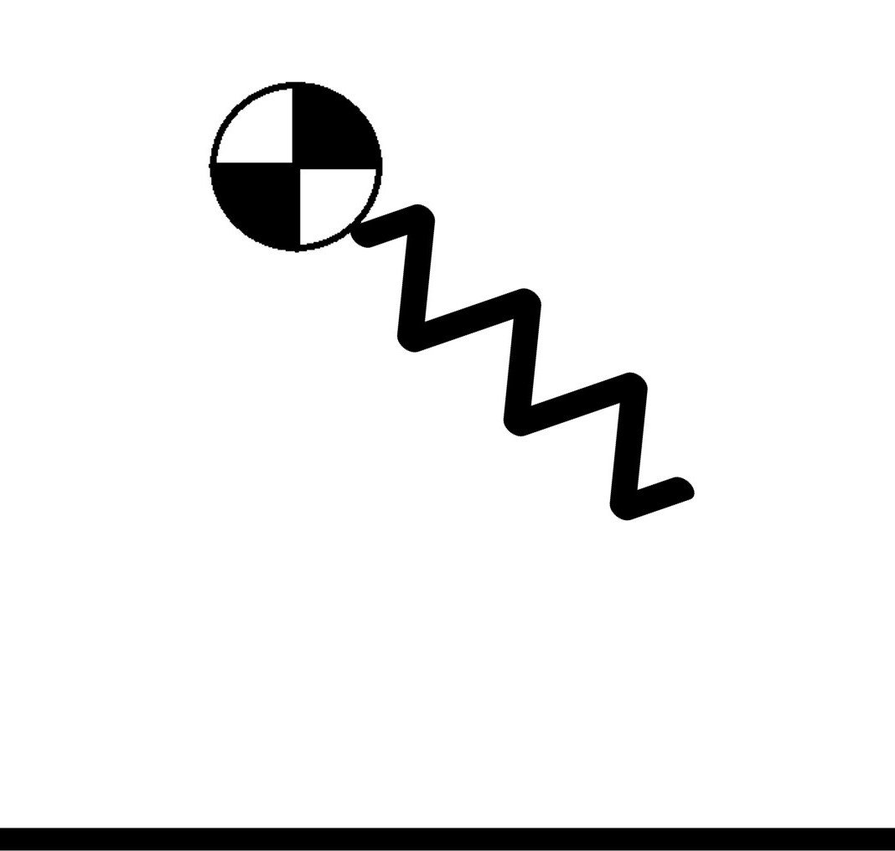
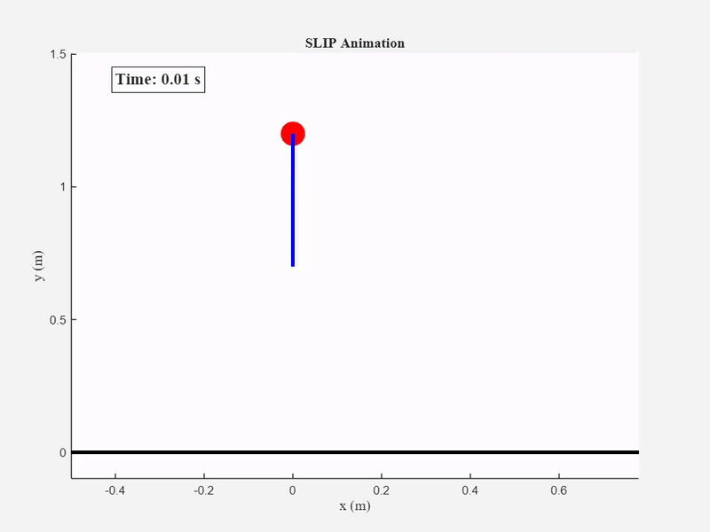

In this repo, I am simulating a mass-spring system to be later used for modeling robotic legs using SLIP model.

Here is a simple demo of the function:

The function simulates a mass attached to a mass-less spring. There are two phases:
- Swing phase: In this phase, the mass is just free falling. The equations governing this phase are
  
$$
    \ddot{y} = -g ,\ \ddot{x} = 0
$$
  
    The spring has its nominal length $l_0$.
- Stance phase: In this phase, the spring is touching the ground. When the spring is compressed, it exerts a force on the mass which will eventaully cuase a lift-off.     
During the stance phase, the dynamics of the system are calculated using the Lagrangian method.
The kinetic energy of the system is

$$
    K = \frac{1}{2} m (\ddot{x}^2 + \ddot{y}^2)
$$

and the potential energy of the system, which consists of gravitational potential energy and spring potential energy is

$$
    P = mgy + \frac{1}{2} k (l - l_0)^2
$$

Enforcing the mass to be above the ground at all times, we get the following Lagrangian

$$
    \mathcal{L} = K - P + \lambda y
$$

This leads to the unconstrained stance phase dynamics

$$
    \begin{align}
        \ddot{x} = \frac{k}{m} (l - l_0) \frac{x - x_c}{l}
        \ddot{y} = \frac{k}{m} (l - l_0) \frac{y}{l}
    \end{align}
$$

meaning this is the dynamics during the stance phase if the mass itself isn't touching the ground. If the mass is touching the ground, an upward force of $mg$ is exerted on it and $y = \dot{y} = \ddot{y} = 0$.

Switching between stance and swing phase happens at touchdown and at lift-off.
Touchdown happens when 

$$
    y < l_0 \cos(\theta) & \dot{y} < 0
$$

where $x_c$ is the contact poin and $\theta$ is the foot placement angle.
Lift-off happens when 

$$
    l = \sqrt{(x - x_c)^2 + y^2} = l_0 & \dot{y} > 0
$$

This is the enitre logic implemented in the code.

TO BE FURTHER COMPLETED.
